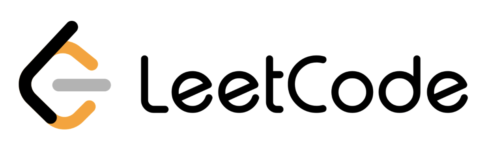

## Solutions to LeetCode practice problems 📝

<h4> 💡Duration💡 </h4>
- JAN 30, 2023 to current 

 

<h4> 🎯Language🎯 </h4>
-<i>  </i>

 
 

***

| # | PROBLEM | SOLUTION | DIFFICULTY | SCORE |
| --- | --- | --- | --- | --- |
| 1 |  | [Solution]() | Easy | |
| 2 |  | [Solution]() | Easy | |
| 3 |  | [Solution]() | Easy | |
| 4 |  | [Solution]() | Easy | |
| 5 |  | [Solution]() | Easy | |
| 6 |  | [Solution]() | Easy | |
| 7 |  | [Solution]() | Easy | |
| 8 |  | [Solution]() | Easy | |
| 9 |  | [Solution]() | Easy | |
| 10 |  | [Solution]() | Easy | |
| 11 |  | [Solution]() | Easy | |
| 12 |  | [Solution]() | Easy | |
| 13 |  | [Solution]() | Easy | |
| 14 |  | [Solution]() | Easy | |
| 15 |  | [Solution]() | Easy | |
| 16 |  | [Solution]() | Easy | |
| 17 |  | [Solution]() | Easy | |
| 18 |  | [Solution]() | Easy | |
| 19 |  | [Solution]() | Easy | |
| 20 |  | [Solution]() | Easy | |

